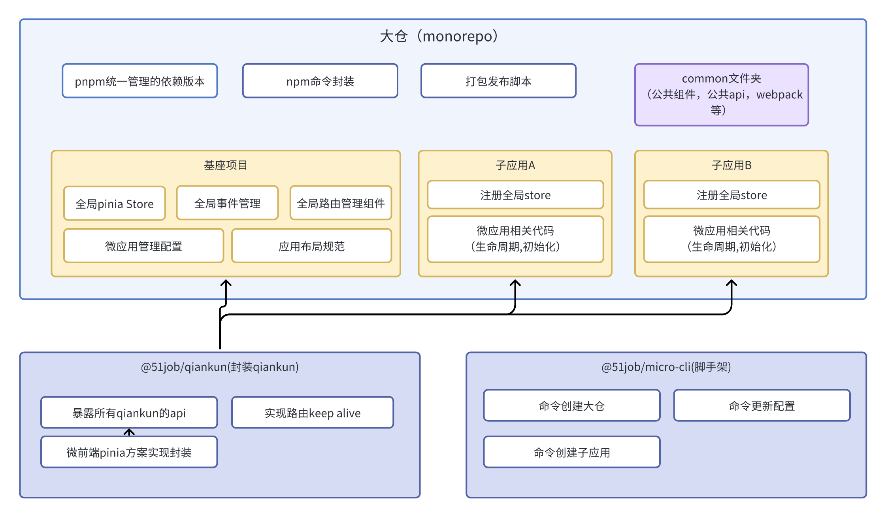

# qiankun-vue-template

`qiankun-vue-template` 是一个基于 [qiankun](https://github.com/umijs/qiankun) 的微前端示例项目。本项目展示了如何利用 qiankun 进行主应用与多个子应用的集成。值得注意的是，整个项目结构都采用 [pnpm](https://pnpm.io/) 进行依赖管理，并且所有应用都是基于 `Vue 2` 构建的，这为统一技术栈并保持高效的前端模块化带来了便利。

## 目录

- [项目架构](#项目架构)
- [项目结构](#项目结构)
- [环境要求](#环境要求)
- [如何开始](#如何开始)
- [打包与部署](#打包与部署)
- [开发指南](#开发指南)
- [常见问题](#常见问题)
- [参与贡献](#参与贡献)

## 项目架构

## 项目结构

## packages
### main（主应用）
- **dist**：构建后的文件目录
- **public**：静态资源文件夹
- **src**：源码目录
  - assets：资源文件夹
    - images：图片资源
    - scss：样式文件
  - components：组件文件夹
    - layout：布局组件
      - header-component：头部组件
      - side-menu：侧边栏菜单组件
  - configs：配置文件夹
    - modules
      - menu.js 配置菜单
      - micro-apps.js 配置微应用
  - plugins：插件文件夹
  - router：路由文件夹
  - store：Pinia状态管理
  - views：页面组件
    - app
    - qiankun
  - main.js
- 根目录配置文件（例如：`.browserslistrc`, `.editorconfig`, `vue.config.js`等）

### sub-vue（子应用）
- **dist**：构建后的文件目录
- **public**：静态资源文件夹
- **src**：源码目录
  - assets：资源文件夹
  - components：组件文件夹
  - router：路由文件夹
  - store：Pinia状态管理
  - views：页面组件
  - App.vue
  - main.js
- 根目录配置文件

- `主应用`: 主应用的目录和功能描述。
- `子应用1`: 子应用1的目录和功能描述。
- (列出其他子应用和相关信息...)

## 环境要求

- Node.js: 16+
- pnpm: ^8.6.9

## 如何开始

1. 克隆该仓库：`git clone git@gitdev.51job.com:fe-biz/51job/qiankun-vue-template.git`
2. 进入项目目录：`cd qiankun-vue-template`
3. 使用pnpm安装依赖：`pnpm install`
4. 启动项目：`pnpm start:all`
5. 预览页面 [http://localhost:8080](http://localhost:8080)

## 打包与部署
- 构建所有项目: pnpm build
- 构建特定项目: pnpm build [项目名]
例如: pnpm build main
- 构建多个项目: pnpm build [项目名1] [项目名2]
例如: pnpm build main sub-vue

## 开发指南

### 如何在父子应用里使用 Pinia

当在父子应用结构中使用 Pinia 时，你可能想要实现 Store 数据之间的同步并触发 UI 的重新渲染。以下是一套标准化的步骤来帮助你实现这个目的：

#### 父应用

1. **创建 Pinia Store**
   - 在 `store/modules` 文件夹内创建你的 Pinia store 文件。
  
2. **集成微应用**
   - 在 `plugin/modules/micro-app.js` 中，将 `useXXXStore` 作为 `props` 传递给子应用（微应用）。

#### 子应用

1. **创建 Global Pinia Store**
   - 在 `store/modules/global` 文件夹下创建你的 Pinia store。建议使用以 `global` 为前缀的 id，例如 `globalUserStore`。

2. **注册应用与 Store**
   - 在 `main.js` 中，应用注册后，调用 `registerStore` 函数，并将从父应用传下来的 `useXXXStore` 作为参数。

3. **在组件中使用 Store**
   - 首先，导入所需的函数和 Store：
     ```javascript
     import { mapStores } from 'pinia';
     import { useGlobalUserStore } from './store/global/userStore';
     ```

   - 然后，在组件的 `computed` 属性中映射 Store：
     ```javascript
     computed: {
       ...mapStores(useGlobalUserStore),
     }
     ```

   - 最后，你可以通过 `this.globalUserStore` 在组件内访问该 Store 的数据。

**注意**: 使用以上方法，父子应用间的 Store 数据将被同步，并且任何数据更改都会自动触发 UI 的重新渲染。

### 如何使用全局 PubSub（基于 [PubSubJS](https://github.com/mroderick/PubSubJS) 实现）

在构建基于 Vue 的应用时，你可能会遇到跨组件或应用之间的通信需求。这种情况下，使用 PubSubJS 作为全局事件总线可能是一个好方法。以下是如何在子应用中集成并使用全局 PubSub 的步骤。

#### 1. 绑定 `globalEvent` 到 Vue

在子应用的入口文件中，将传递下来的 `globalEvent` prop 绑定到 Vue 上。这样，你就可以在任何组件中通过 `this.$globalEvent` 来访问它。

```javascript
Vue.prototype.$globalEvent = props.globalEvent;
```

#### 2. 发布事件

要发布事件，你可以使用 `this.$globalEvent.publish` 方法。这样，其他的订阅者可以监听并响应这个事件。

**例子**:

假设你有一个按钮，点击后希望通知其他组件：

```javascript
methods: {
    handleClick() {
        this.$globalEvent.publish('buttonClicked', 'Button was clicked!');
    }
}
```

#### 3. 订阅事件

为了响应某个特定事件，你可以使用 `this.$globalEvent.subscribe` 方法。订阅者可以在该事件发生时执行一些操作。

**例子**:

想要在按钮点击时得到通知：

```javascript
mounted() {
    this.$globalEvent.subscribe('buttonClicked', (msg) => {
        console.log(msg); // 输出: 'Button was clicked!'
    });
}
```

**注意**: 当组件销毁时，确保取消订阅以避免可能的内存泄漏或不必要的操作。

```javascript
beforeDestroy() {
    this.$globalEvent.unsubscribe('buttonClicked');
}
```

更多 API 详情和高级用法，请参考 [PubSubJS 官方文档](https://github.com/mroderick/PubSubJS)。

### 如何在基座项目里使用 `vue-router`

在使用 `qiankun` 构建的微前端应用中，`qiankun` 会根据配置的 `activeRule` 进行页面跳转。理论上，你并不需要额外的 `vue-router` 来实现路由管理。然而，某些与路由相关的逻辑或业务需求可能难以实现，因此我们可以考虑结合使用 `vue-router`。

#### 1. 初始路由配置

在 `router/index.js` 文件中，我们已经为你定义了一个初始的路由配置：

```javascript
const routes = [
  {
    path: '*',
    name: 'MicroApp',
    component: MicroApp
  }
];
```

该配置的目的是捕获所有的路由请求并将其指向 `MicroApp` 组件。这样，你可以在 `MicroApp` 组件内部执行与路由相关的逻辑或渲染。

#### 2. 针对特定路由执行不同逻辑

如果你希望针对特定的路由路径使用不同的组件或执行不同的逻辑，你可以在 `routes` 数组中添加更多的路由对象。每个对象可以定义一个特定的路径、名称和组件。

#### 3. 使用路由守卫

你可以使用 `vue-router` 的路由守卫功能来实现更复杂的路由控制逻辑。例如，你可能需要在路由跳转前进行用户身份验证或数据预加载。

使用 `router.beforeEach`，你可以在路由跳转之前执行某些操作：

```javascript
router.beforeEach((to, from, next) => {
    // 这里编写你的逻辑代码，如身份验证
    next();
});
```

这样，你就可以在基座项目中灵活地使用 `vue-router`，同时与 `qiankun` 无缝集成。

## 常见问题

**问题1**: 如果我想单独启动某个项目怎么办？

答: 使用pnpm start [项目名]命令。请确保项目名称与packages目录下的文件夹名称保持一致。若启动多个项目，项目名之间用空格分隔。例如: pnpm start project1 project2。

## 参与贡献

**贡献代码**:
- 访问[项目仓库](https://gitdev.51job.com/fe-biz/51job/qiankun-vue-template)。
- 切换到新分支并提交您的代码。
- 代码审核通过后，将合并至`master`分支。

**问题与建议**:
- 请直接通过企业微信与我们联系。

---

**联系信息**: [张禹] - [zhangyu.zhang@51job.com]